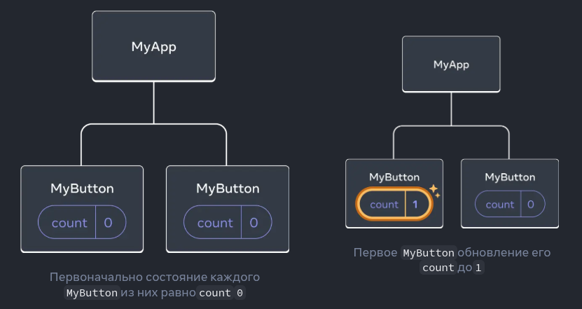
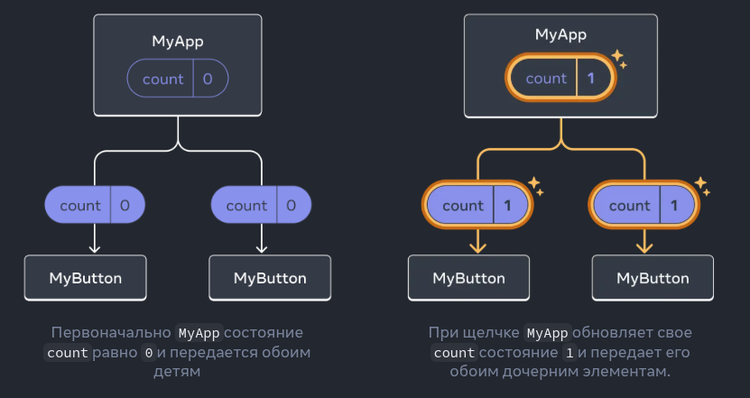

Функции, начинающиеся с , `use`называются _хуками_ . `useState`— это встроенный хук, предоставляемый React. Вы можете найти другие встроенные хуки в [справочнике API.](https://react.dev/reference/react) Вы также можете написать свои собственные хуки, комбинируя существующие.

Хуки накладывают больше ограничений, чем другие функции. Вы можете вызывать хуки только _в верхней части_ компонентов (или других хуков). Если вы хотите использовать их `useState`в условии или цикле, извлеките новый компонент и поместите его туда.

## Обмен данными между компонентами[](https://react.dev/learn#sharing-data-between-components "Ссылка для обмена данными между компонентами")

В предыдущем примере каждый `MyButton`имел свой собственный независимый `count`, и при нажатии каждой кнопки `count`изменялся только для нажатой кнопки:



Однако зачастую вам понадобятся компоненты для _совместного использования данных и их постоянного обновления_ .

Чтобы оба `MyButton`компонента отображались одинаково `count`и обновлялись вместе, необходимо переместить состояние с отдельных кнопок «вверх» к ближайшему компоненту, содержащему их все.

В этом примере это `MyApp`:



Теперь при нажатии любой из кнопок значение `count`в `MyApp`изменится, что приведёт к изменению обоих значений в `MyButton`. Вот как это можно выразить в коде.

Сначала _переместим состояние_ из `MyButton`в `MyApp`:

```JavaScript
export default function MyApp() { 
	const [count, setCount] = useState(0); 
	
	function handleClick() {   
		setCount(count + 1); 
	} 

	return (   
		<div>    
			<h1>Counters that update separately</h1>   
			<MyButton />   
			<MyButton />  
		</div> 
	);
}

function MyButton() {  // ... we're moving code from here ...}
```

Затем _передайте состояние_ из `MyApp`каждого элемента `MyButton`вместе с общим обработчиком щелчков. Вы можете передать информацию с `MyButton`помощью фигурных скобок JSX, как это делалось ранее со встроенными тегами, например ``:

```JavaScript
export default function MyApp() {  
	const [count, setCount] = useState(0); 

	function handleClick() {   
		setCount(count + 1); 
	}  
	
	return (  
		<div>    
		    <h1>Counters that update together</h1>  
		    <MyButton count={count} onClick={handleClick} />   
		    <MyButton count={count} onClick={handleClick} />  
		</div> 
	);
}
```

Информация, которую вы таким образом передаёте, называется _props_ . Теперь `MyApp`компонент содержит `count`состояние и `handleClick`обработчик событий и _передаёт их как props_ каждой кнопке.

Наконец, измените `MyButton`так, чтобы он _считывал_ свойства, переданные из родительского компонента:

```JavaScript
function MyButton({ count, onClick }) { 
	return (  
		<button onClick={onClick}>   
		     Clicked {count} times   
	    </button>  
	);
}
```

При нажатии кнопки `onClick`срабатывает обработчик. Свойство каждой кнопки `onClick`было установлено на `handleClick`функцию внутри `MyApp`, поэтому код внутри неё выполняется. Этот код вызывает `setCount(count + 1)`, увеличивая значение `count`переменной состояния. Новое `count`значение передаётся как свойство каждой кнопке, поэтому все они отображают новое значение. Это называется «поднятием состояния вверх». Поднимая состояние вверх, вы делаете его общим для всех компонентов.


```JavaScript
import { useState } from 'react';

export default function MyApp() {
  const [count, setCount] = useState(0);

  function handleClick() {
    setCount(count + 1);
  }

  return (
    <div>
      <h1>Counters that update together</h1>
      <MyButton count={count} onClick={handleClick} />
      <MyButton count={count} onClick={handleClick} />
    </div>
  );
}

function MyButton({ count, onClick }) {
  return (
    <button onClick={onClick}>
      Clicked {count} times
    </button>
  );
}

```